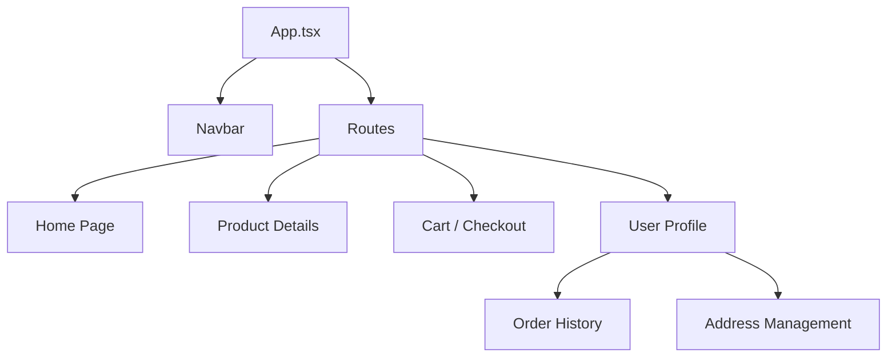

# 🚀 OmniCart - Project Documentation

OmniCart is a cutting-edge, full-stack e-commerce platform built with the **MERN** stack (MongoDB, Express, React, Node.js). It offers a professional, real-time marketplace experience featuring dynamic pricing, secure authentication, and seamless order tracking.

---

## 🎨 1. User Interface (UI)
The OmniCart frontend is built with **React** and **TypeScript**, styled using a premium custom **Tailwind CSS** configuration to deliver a rich, responsive experience.

### Key UI Features:
- **Dynamic Layout**: A mobile-first, responsive design that adapts to any screen size.
- **Dark Mode Support**: Native dark mode integration for a sleek, modern aesthetic.
- **Interactive Components**: 
    - **Order Tracking Stepper**: Visual order progress in the user profile.
    - **Live Cart Sidebar**: Real-time totals and quantities.
    - **Smooth Transitions**: CSS-driven micro-animations for hover states and transitions.



---

## ⚙️ 2. Back-End Architecture
The server is powered by **Node.js** and **Express.js**, providing a robust REST API for handling data management and security.

### Core Backend Components:
- **RESTful API**: Clean, versioned endpoints for Products, Users, and Orders.
- **JWT Authentication**: Secure, stateless authentication using JSON Web Tokens.
- **Middleware**: 
    - **Auth Middleware**: Protects sensitive routes by verifying JWT tokens in headers.
    - **CORS Support**: Configured to allow secure cross-origin requests from the frontend.

```javascript
// Example: Authentication Middleware logic
const protect = async (req, res, next) => {
  let token = req.headers.authorization;
  if (token && token.startsWith('Bearer')) {
    // Verify token and attach user to request
    next();
  } else {
    res.status(401).json({ message: 'Not authorized' });
  }
};
```

---

## 🧠 3. Business Logic & Database
OmniCart uses **MongoDB** as its primary NoSQL database, ensuring high scalability and flexibility for diverse product categories.

### Database Strategy:
- **Models (Mongoose)**: 
    - **User**: Stores authentication data, saved addresses (Home/Work), and payment cards.
    - **Product**: Stores details, stock info, and variant-specific **Price Modifiers**.
    - **Order**: Stores items purchased, snapshots of final prices, and status tracking history.
- **Database Connectivity**: Connected via **MongoDB Atlas** for secure, cloud-hosted data storage.

### Business Logic Highlights:
- **Dynamic Pricing Engine**: Calculates final product cost by combining the base price with variant modifiers (e.g., +₹12,000 for 1TB SSD).
- **Order Tracking**: Automatically generates a 4-step tracking sequence upon purchase, managed via server-side updates.

---

## ✨ 4. Novelty & Technical Excellence
OmniCart distinguishes itself with several unique technical implementations:

### JavaScript Excellence: Luhn Algorithm
For payment security, the "Add Card" feature implements the **Luhn Algorithm** (Mod 10) in real-time. This validates credit card numbers even before they hit the server, preventing invalid data entry.

```javascript
const luhnCheck = (num) => {
  let arr = (num + '').split('').reverse().map(x => parseInt(x));
  let lastDigit = arr.shift();
  let sum = arr.reduce((acc, val, i) => (i % 2 !== 0 ? acc + val : acc + ((val *= 2) > 9 ? val - 9 : val)), 0);
  sum += lastDigit;
  return sum % 10 === 0;
};
```

### Innovative CSS (Rich Aesthetic)
- **Glassmorphism**: Transparent, blurred UI elements create a premium "glass" effect for cards and modals.
- **Dynamic Badges**: Color-coded badges for Order Status (Pending, Shipped, Delivered) using HSL color mapping.

---

## 🚀 5. Deployment (Free Hosting Guide)
The OmniCart platform is production-ready for cross-platform hosting.

### Hosting Plan:
1. **Frontend**: [Vercel](https://vercel.com/) or [Netlify](https://www.netlify.com/).
    - CD/CI from GitHub main branch.
    - Fully automated static site builds.
2. **Backend**: [Render](https://render.com/) Web Services.
    - Set environment variables (`MONGODB_URI`, `JWT_SECRET`).
    - Standard Node.js environment build.
3. **Database**: [MongoDB Atlas](https://www.mongodb.com/cloud/atlas) (Free Tier).

### Steps to Deploy (Manual):
1. **Prepare Database**: Whitelist `0.0.0.0/0` in MongoDB Atlas Network Access.
2. **Deploy Server (Render)**: Connect your repo, set the root directory to `server/`, and add your `.env` variables.
3. **Deploy Client (Vercel/Netlify)**: Connect your repo, set the root directory to `client/`, and set the `VITE_API_URL` to your Render backend URL.

---

© 2026 OmniCart Marketplace. Built with ❤️ by the OmniCart Dev Team.
